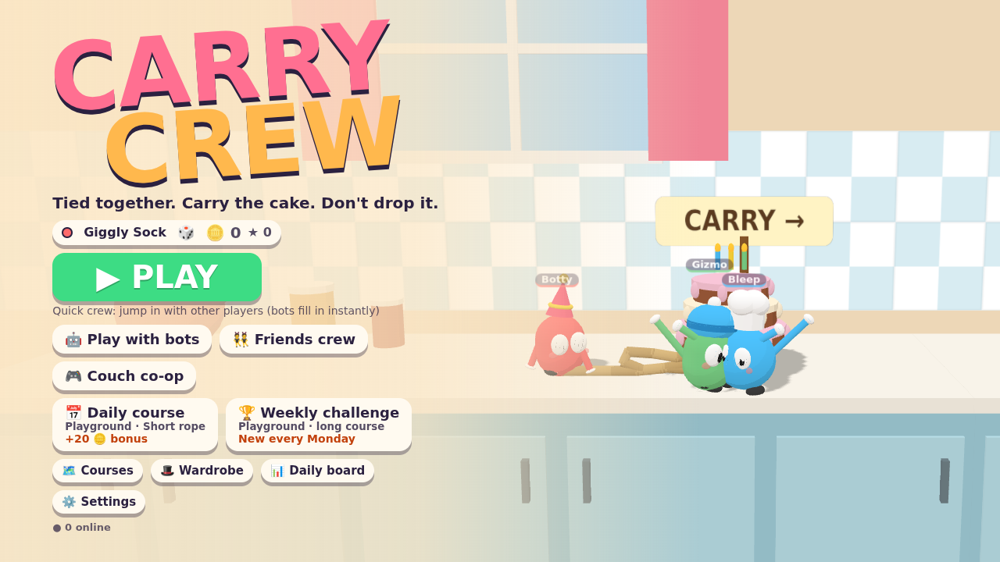
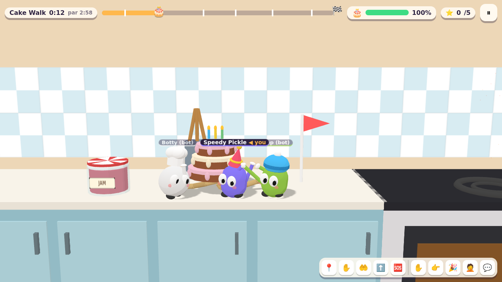
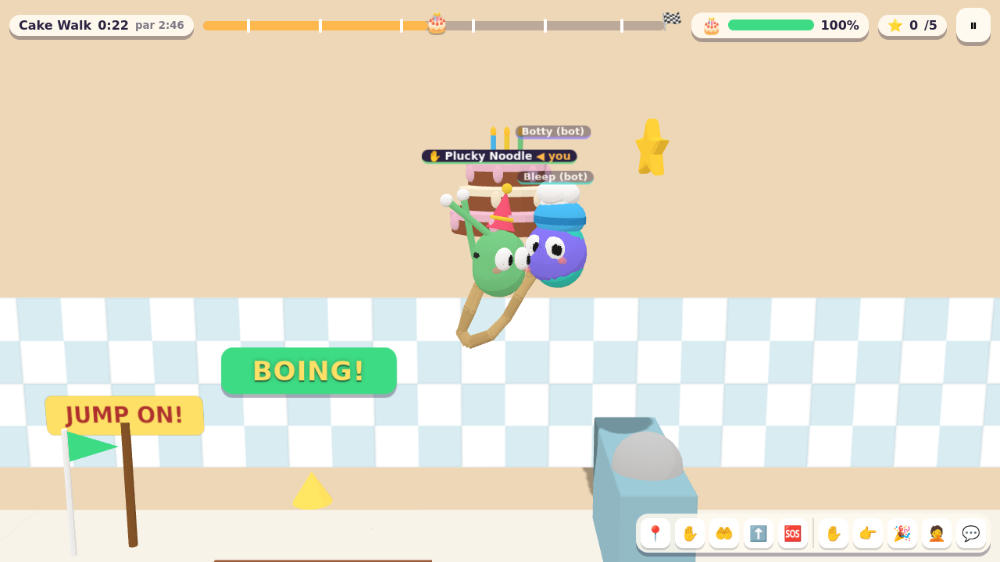
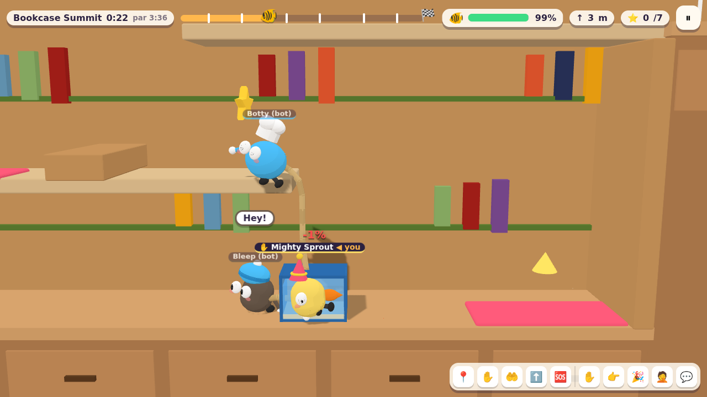

# Carry Crew

**Tied together, carry the cake, don't drop it.**

A co-op physics comedy for the browser. Two to four toy-sized friends are tied together by a rope and carry something fragile through a giant everyday world: a birthday cake across the kitchen, a fish tank over the bed, and grandma's vase across the playground.

This repository is the playable prototype from the game design document. It has three biomes with three flat courses and one tower climb each, online crews (quick match and friends rooms) with bots filling the empty seats, solo play with bot buddies, couch co-op, daily and weekly challenge courses, pings and emotes instead of chat, cosmetics, and clip saving.






## Quick start

```bash
npm install
npm run dev        # game server on :8787 + Vite on :5173 → open http://localhost:5173
```

Production build (one Node process serves the game and the multiplayer server):

```bash
npm run build
npm start          # http://localhost:8787
```

| Script | What it does |
| --- | --- |
| `npm run dev` | Server (auto-restarts) and Vite dev server with hot reload |
| `npm run build` | Client into `dist/client`, server bundle into `dist/server` |
| `npm start` | Run the built server; it also serves the built client |
| `npm test` | Vitest: simulation and server suites |
| `npm run typecheck` | TypeScript, strict |
| `npx tsx scripts/botrun.ts all` | Bot-only crews play every course headless and report results |
| `npx tsx scripts/piecetest.ts` | Bot crews try every course piece at every difficulty |

Server environment: `PORT` (8787), `HOST`, `DATA_DIR` (`./data`: leaderboard, invites, analytics, reports), `STATIC_DIR` (`./dist/client`), `MAX_SOCKETS_PER_IP` (32, roomy because a whole school shares one address), `MAX_RUNNING_ROOMS` (200).

The client works without a server: solo, couch and daily play run entirely in the browser, and online modes fall back to bots. For portal builds hosted elsewhere, set `VITE_SERVER_URL=https://your-server` at build time (or pass `?server=` in the URL).

## How to play

| Action | Keyboard | Gamepad | Touch |
| --- | --- | --- | --- |
| Move | `A` `D` / `←` `→` | Left stick / D-pad | Left joystick |
| Jump | `Space` / `W` | A | JUMP |
| Grab (hold): ledges, the rope, the cargo | `Shift` / `J` | X / RB / RT | GRAB |
| Climb the rope / pull up a ledge | `W` `S` while holding | Stick up/down | Joystick up/down |
| Dive | `K` / `X` | B | DIVE |
| Panic grab (once per checkpoint) | Hold grab while falling | same | same |
| Pings: go here, wait, grab, jump now, help | `1`–`5` (at the mouse pointer) | LB + D-pad / Y | HUD buttons |
| Emotes: high-five, blame, cheer, facepalm | `6`–`9` | Y (cheer) | HUD buttons |
| Quick chat (preset phrases only) | `T` | | 💬 |
| Pause, clip, crew list | `Esc` / `P` | Start | ⏸ |

Couch co-op: player 1 uses `WASD` + `F` (grab) + `G` (dive), player 2 uses the arrows + `.` (grab) + `/` (dive), and plugged-in gamepads take players 3–4.

Two holders lift the cargo properly; one alone can only drag it. Bumps and drops cost cargo health, and stars reward an intact, fast delivery: 1 for delivering, 2 at 60% or more intact, 3 at 85% or more intact and under par time.

## What's in the prototype

| GDD item | Status |
| --- | --- |
| Wobbly bodies, move / jump / grab / dive | ✅ Round toy characters with squash and stretch, flailing arms, flops |
| Elastic rope that wraps around objects and can be climbed | ✅ Jointed segments with a hard length limit; climb with up/down while holding |
| Fragile cargo with a damage meter and quirks | ✅ Cake loses layers, fish tank sloshes, vase is top-heavy, plates slide off a tray (twist) |
| Checkpoints, respawn with damage, panic grab once per checkpoint | ✅ |
| Kitchen, kid's bedroom, playground × 3 courses, delivery scenes | ✅ Party, aquarium, grandma, plus a tower course per biome (Fridge Tower, Bookcase Summit, Tree House) |
| Verticality | ✅ Springboards (toaster, bed spring, trampoline) that charge up and catapult the whole crew and the cargo; tower floors stacked inside furniture with lifts; a missed landing drops you a floor, dangling from your crew |
| Ragdoll comedy | ✅ Floppy verlet arms and legs, bobble heads, jelly wobble, flailing in the air; rope yanks, hard landings, knocks and dives send you tumbling (dizzy stars included) |
| Hazards: stove, tap, cat, toy car, sleeping dog, fan, swings, football, wind | ✅ |
| Daily and weekly courses with twists (low gravity, heavy cargo, short/long rope, plates, extra fragile) | ✅ Seeded per day/week, same for everyone |
| Hidden collectibles | ✅ Gold stars on each piece, some off the main path |
| Quick crew: fill to 4 in 10 s, then bots; late joiners take a bot's seat | ✅ |
| Friends crew: room code + invite link, host picks the course | ✅ |
| Solo with bot buddies | ✅ Bots carry, follow in rope order, time hazards, panic-grab, climb out of pits |
| Leavers replaced by bots at once | ✅ |
| Rough skill grouping by stars | ✅ Three brackets for quick crews |
| Context pings with gibberish voice lines, physical emotes, preset chat | ✅ No voice, no free text |
| Stars, coins, cosmetics (colours, bodies, hats, ropes) | ✅ |
| Clip saving: last 15 s with the game's name | ✅ Replays recorded game state into a WebM |
| Invite rewards | ✅ Invite link credits the inviter (halo hat, friendship-bracelet rope) |
| Ads between courses, rewarded ads (double coins, patch up the cargo) | ✅ CrazyGames / Poki SDK bridge; no-op on the plain web build |
| Analytics: session start, first checkpoint, course complete, D1/D7 return, crew size | ✅ Anonymous id → `data/analytics.jsonl` |
| Safety: generated names only, block, report, vote-kick | ✅ |
| Crew race, chaos courses, course editor, seasons, Steam build | ⏭ Later, as in the roadmap |

## Architecture

```
src/shared/   the game itself: runs identically in the browser and on the server
  sim.ts        Rapier 2D world: bodies, rope, carry controller, hazards, rules, snapshots
  bot.ts        bot crewmates (crew planner, hazard timing, hints, climbing, panic grabs)
  courses.ts    course pieces per biome, course assembly, daily/weekly generation, twists
  types.ts, protocol.ts, cosmetics.ts, names.ts, constants.ts
src/server/   authoritative Node server: rooms, matchmaking, 60 Hz sim loop, HTTP API, static files
src/client/   Three.js 2.5D renderer, input, UI, audio (all synthesized), sessions, clips, portal SDK
tests/        vitest suites for the simulation and the server
scripts/      headless bot runs and per-piece checks
```

- **Physics:** the GDD proposes Rust with Rapier 2D shared between client and server. The prototype uses Rapier's official WebAssembly build (`@dimforge/rapier2d-compat`), so the same Rust physics runs in both places without a custom toolchain. The game rules around it are TypeScript shared by both sides.
- **Networking:** the server is authoritative and steps each crew at 60 Hz, sending snapshots at 20 Hz over WebSockets. Clients send inputs with press counters, so a dropped packet never loses a jump. Shared objects (rope, cargo, crewmates) are interpolated 100 ms behind; your own character is drawn from the newest state, extrapolated by its velocity.
- **The carry controller:** cargo is pulled toward the holders' hands by a capped force instead of rigid joints. Obstacles still block and bump it, holders feel the drag, and if it snags too far behind it slips out of their hands. Players pass through the cargo and each other; the rope and the grip tie the crew together.
- **Rendering:** low-poly toon-shaded meshes on a 2D plane with a follow camera that frames the whole crew. It has a low-quality mode for school Chromebooks (no shadows or antialiasing, 1× pixel ratio). The first download is about 1.5 MB gzipped.

## Notes and known gaps

- Courses currently take 1–4 minutes for a good crew. The GDD targets 8–15, which means adding more pieces per course once the fun is proven.
- Bot-only crews usually finish 10 of the 12 courses unaided; it varies run to run because the physics is chaotic. The bedroom bridge gap and the springboards on the higher tower floors sometimes need a human to lead.
- Springboards aim at their landing spot, so a crew that stands on one together flies together. Stragglers get yanked by the rope, which is the point.
- Own-character prediction is velocity extrapolation, not full client-side re-simulation. The 150 ms lag budget still needs testing on real school Wi-Fi, as the GDD says.
- Clips are WebM (MP4 where the browser records it). Safari support depends on the browser's MediaRecorder.
- The ad and portal hooks are wired, but no ad network is configured on the plain web build: rewarded bonuses are simply granted there.
- Privacy: guest play only, with a random anonymous id and no personal data. A legal review is still needed before launch.
